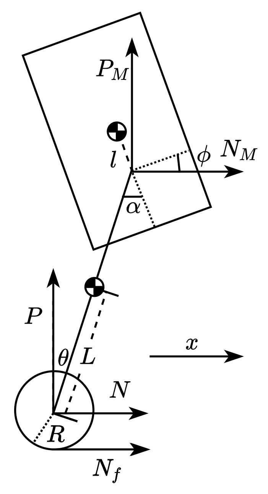
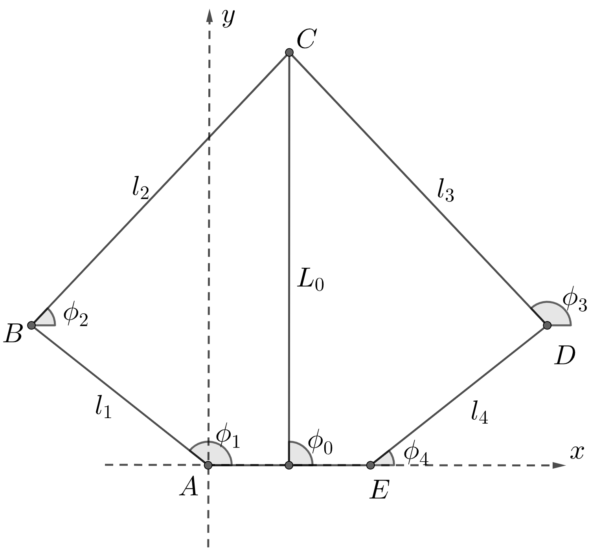

<!--
 * @Author: JL HUANG
 * @Date: 2026-07-08 01:54:14
 * @LastEditors: JL HUANG
 * @LastEditTime: 2026-07-08 18:55:46
 * @FilePath: \Wheel_Leg_Balance\README.md
 * @Description: 
 * Copyright (c) 2026 by JL HUANG, All Rights Reserved. 
-->
# Wheel Leg Balance Control

本项目展示了使用LQR+VMC的轮腿平衡机器人的控制方案，通过将机构简化抽象为二阶倒立摆，再单独融合VMC进行腿部的姿态解算和力矩控制，实现了机体控制的高效简化。

仿真结果：

运动展示1：

运动展示2：

## 系统建模

对于机器人平衡与纵向运动问题，主要关注机器人上层机构与腿部的姿态以及驱动轮的运动，并忽略机器人腿长变化，仅考虑腿的姿态，即驱动轮轴与腿部两关节电机转轴中心的连线相对惯性系的角度。

机器人上层机构为机体、驱动轮轴与腿部机构转轴的连线为摆杆，得到如图所示轮腿倒立摆模型。

将模型抽象为三个刚体组成的二阶倒立摆，对其建立模型：
驱动轮：

$$ m_{\dot{w}} \ddot{x}= N_f - N $$

$$ I_\omega \frac{\ddot{x}}{R} = T - N_fR $$

摆杆：

$$ N - N_M = m_p \frac{ \partial^2}{\partial t^2}(x + L \sin \theta) $$

$$ P - P_M - m_pg= m_p \frac{ \partial^2}{\partial t^2}(L \cos \theta) $$

$$I_p \ddot{\theta} = (PL + P_M L_M) \sin\theta - (NL + N_M L_M) \cos\theta - T + T_p$$

机体：

$$ N_M = M \frac{\partial^2}{\partial t^2}\left(x + (L + L_M) \sin\theta - l \sin\phi\right) $$

$$ P_M - M g = M \frac{\partial^2}{\partial t^2}\left((L + L_M) \cos\theta + l \cos\phi\right) $$

$$ I_M \ddot{\phi} = T_p + N_M l \cos \phi + P_M l \sin \phi $$

定义状态向量$ x $与控制向量$ u $分别为：

$$ x = \begin{bmatrix} \theta \\ \dot{\theta} \\ x \\ \dot{x} \\ \phi \\ \dot{\phi} \end{bmatrix}, \quad u = \begin{bmatrix} T \\ T_p \end{bmatrix} $$

定义系统非线性模型：

$$ \dot{x} = f(x,u)$$

根据建立的物理模型消去中间变量$ P,N,P_M,N_M $，并进行求解以得到系统非线性模型符号表达式。根据状态向量$ x $与控制向量$ u $，求非线性模型平衡点处雅可比矩阵对其线性化，即：

$$A = \frac{\partial f}{\partial x}(\mathbf{x}, \mathbf{u}), \quad B = \frac{\partial f}{\partial u}(\mathbf{x}, \mathbf{u})$$

其中$ \tilde x,\tilde u $为系统平衡点，即方程$ f(\tilde x,\tilde u)=0 $的解：

$$ \tilde{x} = \begin{bmatrix}0 \\ x \\ 0 \\ 0 \\ 0 \\ 0\end{bmatrix} \qquad \tilde{u} = \begin{bmatrix}0 \\ 0\end{bmatrix} $$

$$ \tilde{x} = \begin{bmatrix}0 & 1 & 0 & 0 & 0 & 0 \\ A_1 & 0 & 0 & 0 & A_2 & 0 \\ 0 & 0 & 0 & 1 & 0 & 0 \\ A_3 & 0 & 0 & 0 & A_4 & 0 \\ 0 & 0 & 0 & 0 & 0 & 1 \\ A_5 & 0 & 0 & 0 & A_6 & 0\end{bmatrix} x + \begin{bmatrix}0 & 0 \\ B_1 & B_2 \\ 0 & 0 \\ B_3 & B_4 \\ 0 & 0 \\ B_5 & B_6\end{bmatrix} u $$

所有状态变量均可通过直接测量或融合解算得到解析结果，故系统输出$ y $为：

$$ y=I_6x $$

其中$ I_6 $为6维单位阵。通过带入模型参数确定该状态空间模型状态矩阵$A$和控制矩阵$B$，其可控矩阵满秩，系统可控。系统输出矩阵$C$为单位阵，系统显然可观。

## LQR

根据上述轮腿倒立摆模型，设计控制律为系统状态的线性组合，即：

$$ u = -Kx = -\begin{bmatrix}K_{11} & K_{12} & K_{13} & K_{14} & K_{15} & K_{16} \\ K_{21} & K_{22} & K_{23} & K_{24} & K_{25} & K_{26}\end{bmatrix} \begin{bmatrix}\theta \\ \dot{\theta} \\ x \\ \dot{x} \\ \phi \\ \dot{\phi}\end{bmatrix} $$

采用LQR计算反馈矩阵，定义代价函数为：

$$J = \int_{0}^{\infty} \bigl(x^{T}Qx + u^{T}Ru\bigr) \ dt$$

为使代价函数最小，输入应满足：

$$u = -R^{-1} B^{T} P x $$

即反馈增益满足：

$$K = R^{-1} B^{T} P$$

其中$P$满足代数$Riccati$方程：

$$A^{T}P + P A - P B R^{-1} B^{T} P + Q = 0$$

通过上述方法即可在线性化平衡点附近实现系统稳定。为使机器人跟踪轨迹，还需在系统输入中加入参考输入，即：

$$u=K(x_d-x)$$

其中参考输入$x_d$由机器人位置期望$\tilde x$构成：

$$ \tilde{x} = \begin{bmatrix}0 \\ x \\ 0 \\ 0 \\ 0 \\ 0\end{bmatrix} \qquad $$

为考虑机器人不同腿长的工况，在腿长区间内每10mm对系统模型进行一次线性化，并求解其反馈增益矩阵$K$。对矩阵每一个元素$K_{i,j}$随腿长$L_0=L+L_M$的变化拟合多项式方程得到：

$$K_{ij}(L_0) = p_{0|ij} + p_{1|ij}L_0 + p_{2|ij}L_0^2 + p_{3|ij}L_0^3$$

机器人纵向运动控制律为：

$$u = K(L_0)(x_d - x)$$

## VMC

要得到机器人腿长$L_0$需要对机器人腿部平面五杆机构进行正运动学解算。而轮腿倒立摆模型中$T_p$则需要运用虚拟模型控制VMC的思想，根据$T_p$获得两关节电机输出扭矩。

$$ \begin{cases} x_B + l_2 \cos \phi_2 = x_D + l_3 \cos \phi_3 \\ y_B + l_2 \sin \phi_2 = y_D + l_3 \sin \phi_3 \end{cases} $$

解得：

$$\phi_2 = 2 \arctan\left(\frac{B_0 + \sqrt{A_0^2 + B_0^2 - C_0^2}}{A_0 + C_0}\right)$$

其中：

$$A_0 = 2l_2(x_D - x_B) \\ B_0 = 2l_2(y_D - y_B) \\ C_0 = l_2^2 + l_2^{2} - l_3^{2} \\ l_B = \sqrt{(x_D - x_B)^2 + (y_D - y_B)^2}$$

得到角度$\phi_2$后即可解算出$C$点坐标。
VMC是一种直觉控制方式，其关键是在每个需要控制的自由度上构造恰当的虚拟构件以产生合适的虚拟力。虚拟力不是实际执行机构的作用力或力矩，而是通过执行机构的作用经过机构转换而成。为了将工作空间的力或力矩映射成关节空间的关节力矩，需要这两个空间的位置映射关系，即正运动学模型：

$$x=f(q)$$

其中$x=\begin{bmatrix}L_0 & \phi_0 \end{bmatrix}^T$，$q=\begin{bmatrix}\phi_1 & \phi_4 \end{bmatrix}^T$。求$x$全微分得：

$$\begin{cases} \delta L_0 = \frac{\partial f_1}{\partial \phi_1}\, \delta \phi_1 + \frac{\partial f_1}{\partial \phi_4}\, \delta \phi_4 \\[6pt] \delta \phi_0 = \frac{\partial f_2}{\partial \phi_1}\, \delta \phi_1 + \frac{\partial f_2}{\partial \phi_4}\, \delta \phi_4 \end{cases}$$

雅可比矩阵为：

$$J = \left[ \begin{array}{cc} \frac{\partial f_1}{\partial \phi_1} & \frac{\partial f_1}{\partial \phi_4} \\[6pt] \ \frac{\partial f_2}{\partial \phi_1} & \frac{\partial f_2}{\partial \phi_4} \end{array} \right]$$

$$\delta x = J \delta q$$

即通过雅可比矩阵$J$将关节速度$\dot{q}$映射为五连杆姿态变化率$\dot{x}$。根据虚功原理，有：

$$T^{T} \delta q + (-F)^{T} \delta x = 0$$

其中$T=\begin{bmatrix}T_1 & T_2 \end{bmatrix}^T$为前后两关节电机输出力矩列向量，$F=\begin{bmatrix}F & T_p \end{bmatrix}^T$为腿部五连杆机构沿腿的推力$F$与沿中心轴的力矩$T_p$构成的列向量。将式$\delta x = J \delta q$代入，有：

$$T = J^{T} F$$

通过正运动学模型雅可比矩阵即可解算出关节电机输出力矩。
